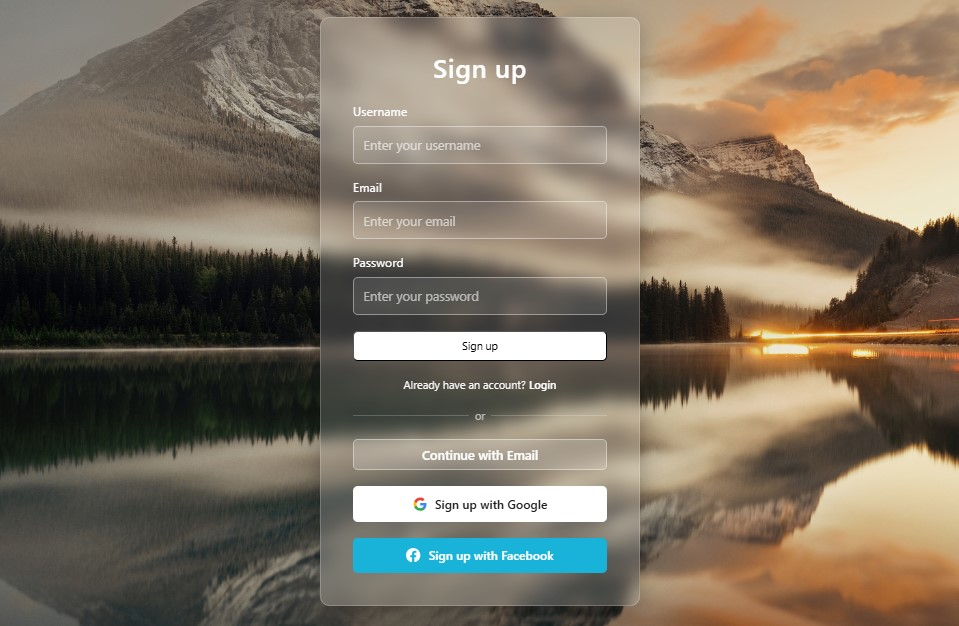
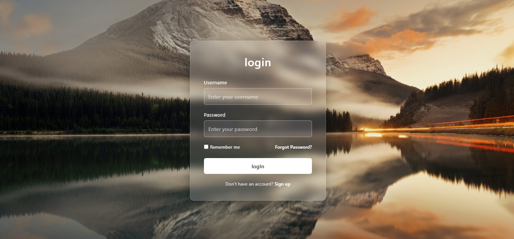
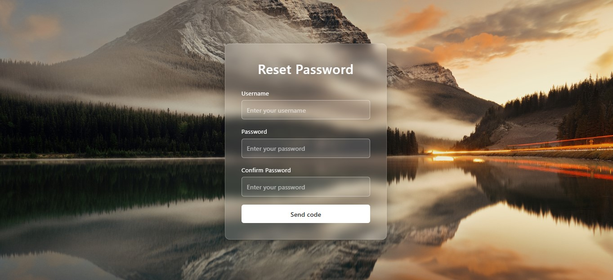

# crystal-auth-ui

# Glassmorphism Authentication UI

A modern and responsive authentication interface built using HTML and CSS. This project includes Login, Sign Up, and Reset Password pages with a beautiful glassmorphism design and a scenic background image.

## Features

- Modern Glassmorphism UI
- Responsive Design
- Sign Up Page
- Login Page
- Reset Password Page
- Custom Background Image
- Clean and Simple Layout
- Beginner-Friendly Source Code

## Screenshots

### Sign Up Page



### Login Page



### Reset Password Page



## Technologies Used

- HTML5
- CSS3

## Project Structure

```text
Glassmorphism-Auth-UI/
│
├── signup.html
├── login.html
├── reset-password.html
├── background.jpg
├── css/
│   └── style.css
│
├── images/
│   ├── Sign_up.jpg
│   ├── Log_in.jpg
│   └── Reset_pw.jpg
│
└── README.md
```

## Future Improvements

- Form Validation with JavaScript
- Dark/Light Theme Toggle
- Backend Authentication Integration
- Database Connectivity
- Password Visibility Toggle
- Remember Me Functionality

## Author

Tondra Shaha

## License

This project is licensed under the MIT License.
